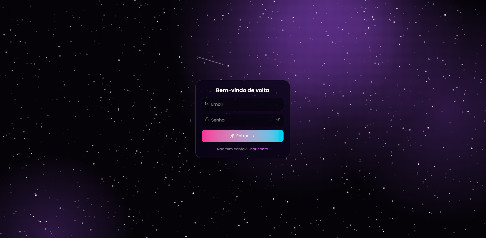
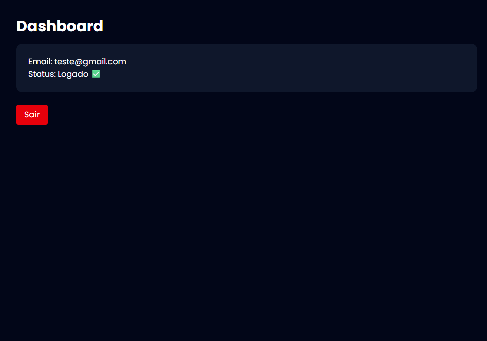

# CRUD Hub • Full Stack

> Sistema completo de autenticação e gerenciamento de usuários com Spring Boot, Next.js e PostgreSQL.

**Demo ao vivo:** https://crudhub.vercel.app


---

## Visão Geral

CRUD Hub é uma aplicação full stack para portfólio que implementa o fluxo completo de autenticação: registro, login, listagem, edição e exclusão de usuários. O projeto foi pensado para mostrar domínio de arquitetura moderna, separação de responsabilidades e boas práticas de segurança.

## Funcionalidades

- Registro de novos usuários com validação
- Login com autenticação via JWT
- Listar todos os usuários cadastrados
- Atualizar dados do usuário
- Deletar usuário
- Proteção de rotas no frontend
- API REST documentada

## Stack

| Camada | Tecnologia |
| --- | --- |
| Frontend | Next.js 14, React, TypeScript, Tailwind CSS |
| Backend | Spring Boot 3, Java 17, Spring Security, JWT |
| Banco | PostgreSQL |
| Deploy | Vercel (front) • Render/Railway (back) |

## Estrutura

```
CRUD-FullStack/
├── backend/
│   ├── src/main/java/com/crudhub/
│   ├── src/main/resources/application.properties
│   └── pom.xml
└── frontend/
    ├── app/
    ├── components/
    └── package.json
```

## Como rodar local

### 1. Backend
```bash
cd backend
# configure o banco no application.properties
spring.datasource.url=jdbc:postgresql://localhost:5432/crudhub
spring.datasource.username=postgres
spring.datasource.password=sua_senha

./mvnw spring-boot:run
```
API disponível em `http://localhost:8080`

### 2. Frontend
```bash
cd frontend
npm install

# crie .env.local
NEXT_PUBLIC_API_URL=http://localhost:8080

npm run dev
```
App disponível em `http://localhost:3000`

## Variáveis de Ambiente

**Backend (`application.properties`)**
```
JWT_SECRET=sua_chave_secreta
JWT_EXPIRATION=86400000
```

**Frontend (`.env.local`)**
```
NEXT_PUBLIC_API_URL=https://sua-api.com
```

## Screenshots




## Próximos passos

- [ ] Refresh token
- [ ] Recuperação de senha por email
- [ ] Testes unitários com JUnit e Jest
- [ ] Docker Compose para subir tudo com um comando
- [ ] > Decidi manter o projeto focado no CRUD completo com JWT, que era o objetivo de aprendizado. As features acima ficam como ideias para uma v2.

## Autor

Feito por **Bruno Alm**  
[GitHub](https://github.com/BrunoOAlm) • [Demo](https://crudhub.vercel.app)

---
Licença MIT • 2026
